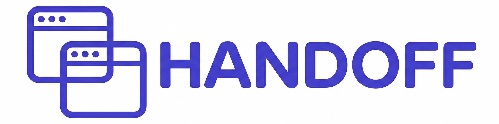

<p align="center">
  
</p>

<p align="center">
  <strong>Session continuity for Claude Code.</strong>
</p>

<p align="center">
  <a href="#installation">Installation</a> •
  <a href="#usage">Usage</a> •
  <a href="#how-it-works">How It Works</a>
</p>

---

Every Claude session starts fresh. You remember what you were working on yesterday - what got done, what broke, where you left off. Claude doesn't. This plugin fixes that.

Think hospital shift change. Doctors don't try to remember everything about every patient. They do structured handoffs: current status, what happened, what to watch for, what's next. Same idea here.

Nothing fancy. Hope it's useful.

## Installation

Inside Claude Code:
```shell
/plugin install ramonclaudio/handoff
```

Or from your terminal:
```bash
claude plugin install ramonclaudio/handoff
```

## Usage

Three ways to invoke:

| Method | Example | When to use |
|--------|---------|-------------|
| **Command** | `/handoff start` | Explicit control |
| **Skill** | Claude auto-invokes | Says "handoff", "save progress", "resume" |
| **Agent** | "Use handoff agent" | Delegate to specialized agent |

### Commands

```shell
/handoff init    # First time: create .handoff/ structure
/handoff start   # Beginning of session: gather context
/handoff end     # End of session: archive state
```

### As a Skill

Claude automatically invokes handoff when you mention:
- "let's do a handoff", "save my progress", "context is full"
- "pick up where we left off", "resume work", "start session"

### As an Agent

Ask Claude to use the handoff agent for autonomous session management:
- "Use the handoff agent to save my progress"
- "Have the handoff agent gather context"

## Structure

```text
.handoff/
├── CONTEXT.md     # Project: stack, commands, critical paths, gotchas
├── HANDOFF.md     # Session: severity, health, done, failed, blockers, resume
└── sessions/      # Archived handoffs
```

## How It Works

### START

1. Find last session timestamp
2. Read CONTEXT.md and HANDOFF.md
3. Get commits/PRs/issues since last session
4. Check for drift (state changed since handoff?)
5. Output structured summary

### END

1. Archive current HANDOFF.md
2. Run health checks (build/test/lint)
3. Capture git state
4. Document: done, failed (with why), blockers, watch-outs
5. Set severity and resume point
6. Validate handoff quality

## Severity

| Level | Meaning |
|-------|---------|
| 🔴 CRITICAL | Production down, security issue |
| 🟡 IN PROGRESS | Mid-feature, tests failing |
| 🟢 READY | All green, clean state |

## Requirements

- Claude Code 2.1+
- Git
- Optional: `gh` (GitHub CLI), Linear MCP

## License

[MIT](LICENSE)
